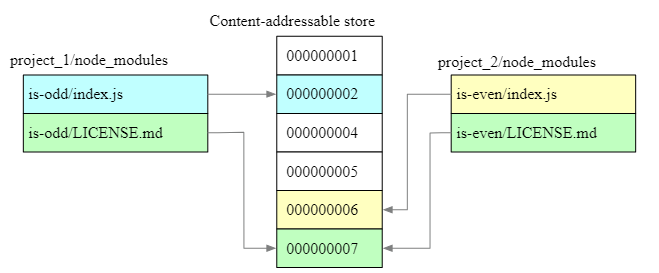

# Package Managers

## Mental model

A package manager is a tool that handles the installation, management, and sharing of software libraries and dependencies within a project.

## Preview

A package manager is a tool that automates the process of installing, updating, configuring, and removing software packages. It is a collection of software tools that automates the process of installing, upgrading, configuring, and removing computer programs for a computer's operating system in a consistent manner.

## Details

npm, yarn, and pnpm are the most popular package managers for JavaScript. They all have their own strengths and weaknesses, and the choice of which one to use depends on the specific needs of the project.

| Feature                | NPM       | YARN      | PNPM                                                                          |
| ---------------------- | --------- | --------- | ----------------------------------------------------------------------------- |
| Speed                  | Slow      | Fast      | Faster                                                                        |
| Disk Space             | High      | Low       | Lower                                                                         |
| Security               | Low       | High      | Higher                                                                        |
| Compatibility          | High      | Medium    | Medium                                                                        |
| Popularity             | High      | Medium    | Low                                                                           |
| Ecosystem              | Rich      | Medium    | Medium                                                                        |
| CLI                    | Simple    | Complex   | Similar to NPM                                                                |
| node_modules directory | flattened | flattened | symlinks to remain 100% compatible with the NodeJS module resolution standard |

### npm

npm is the default package manager for Node.js. It is used to install, share, and distribute code, and manage dependencies in JavaScript projects. It is the most widely used package manager for JavaScript, and it comes pre-installed with Node.js.

### yarn

yarn is a package manager for JavaScript that was created by Facebook. It was designed to be a faster, more reliable, and more secure alternative to npm. It is compatible with the npm registry, and it can be used as a drop-in replacement for npm.

### pnpm

pnpm is a fast, **disk-space efficient** package manager. It is designed to be faster and more efficient than npm and yarn, and it uses a unique approach to package management that allows it to share dependencies across projects. It is compatible with the npm registry, and it can be used as a drop-in replacement for npm.

When using npm, if you have 100 projects using a dependency, you will have 100 copies of that dependency saved on disk. With pnpm, the dependency will be stored in a content-addressable store, so:

If you depend on different versions of the dependency, only the files that differ are added to the store. For instance, if it has 100 files, and a new version has a change in only one of those files, pnpm update will only add 1 new file to the store, instead of cloning the entire dependency just for the singular change.
All the files are saved in a single place on the disk. When packages are installed, their files are hard-linked from that single place, consuming no additional disk space. This allows you to share dependencies of the same version across projects.
As a result, you save a lot of space on your disk proportional to the number of projects and dependencies, and you have a lot faster installations!

## Notes

pnpm for the win! I still miss enough feedback and experience to make a definitive choice but pnpm seems to be the best choice for now.

## Links

- [npm](https://www.npmjs.com/)
- [yarn](https://yarnpkg.com/)
- [pnpm](https://pnpm.io/)

- [choosing the right package manager](https://hackernoon.com/choosing-the-right-package-manager-npm-yarn-or-pnpm)
- [comparing package manager, whichh one is right for your distributed project](https://romanglushach.medium.com/comparing-npm-yarn-and-pnpm-package-managers-which-one-is-right-for-your-distributed-project-to-4d7de2f0db8e)
- [a comparison of yarn, npm and pnpm](https://muratkaragozgil.medium.com/a-comparison-of-yarn-npm-and-pnpm-7d6310f97bd7)
- [package managers](https://rushjs.io/pages/maintainer/package_managers/)
- [pbmp vs npm and yarn](https://refine.dev/blog/pnpm-vs-npm-and-yarn/)
- [npm vs yarn vs pnpm](https://www.atatus.com/blog/npm-vs-yarn-vs-pnpm/)
